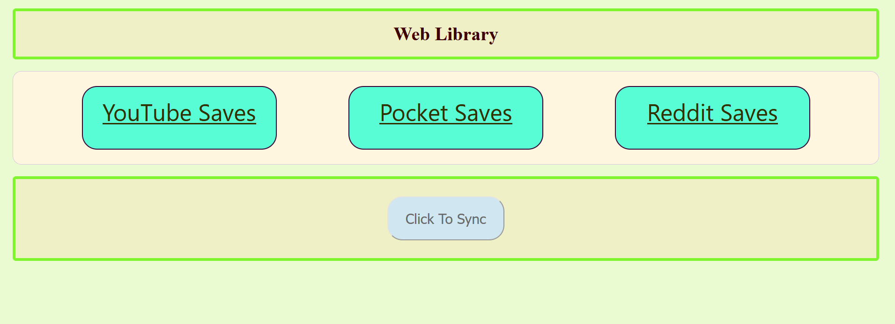
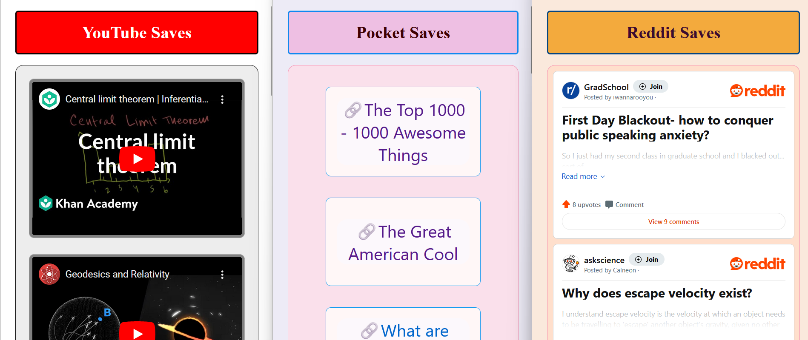

# Web Library
### Minimal node web app that I made to be able to store all my web saves locally. 

## Basic working of this Prototype:
- ### Firstly, I add the webpages I want to save from any website, to my Pocket saves, from any device like my phone or laptop.
- ### Then, whenever I run this app, it fetches all those saves from Pocket and stores them locally, removing them from Pocket.
- ### After this, I can do whatever I want with the saves which I have stored in a JSON file in a simple { "link": "title" } format.
- ### Currently, I am just displaying them, but hypothetically I could make them searchable, and analyse them and so on.

## How to use?
- ### Just fork and clone the whole project onto your local system.
- ### Go to the base directory of the project, to run it with Node JS.
- ### To connect with pocket one needs a "platform consumer key." ([See Here!](https://getpocket.com/developer/docs/authentication))
- ### After authenticating with it successfully, the Web Library is fully functional.

---

---

## Contributing
- Open an issue for bugs or feature requests on the [GitHub repository](https://github.com/chitwan27/webLibrary/issues).
- Fork the repository, make your changes, and submit a pull request.
- I welcome everyone to give any valuable feedback on this project.

## License
This project is licensed under the MIT License. See the [LICENSE](https://github.com/chitwan27/webLibrary/blob/main/LICENSE) file for details.

## Contact
For any questions or suggestions, reach out via [GitHub Issues](https://github.com/chitwan27/webLibrary/issues).